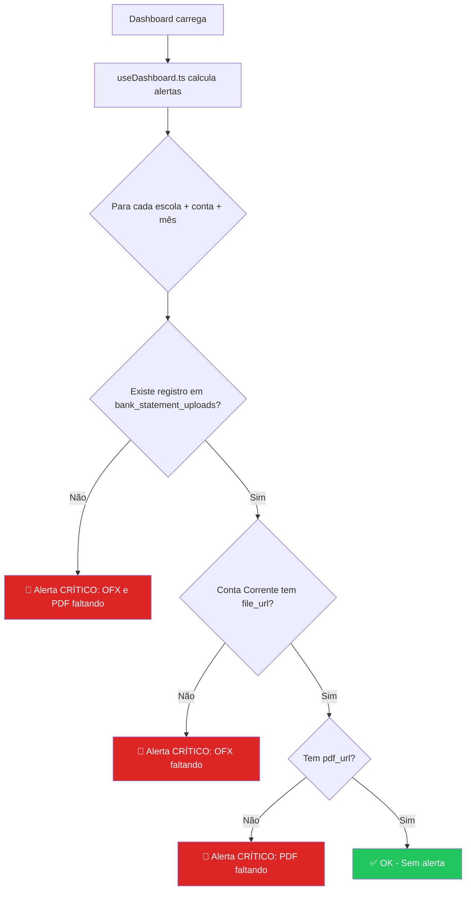
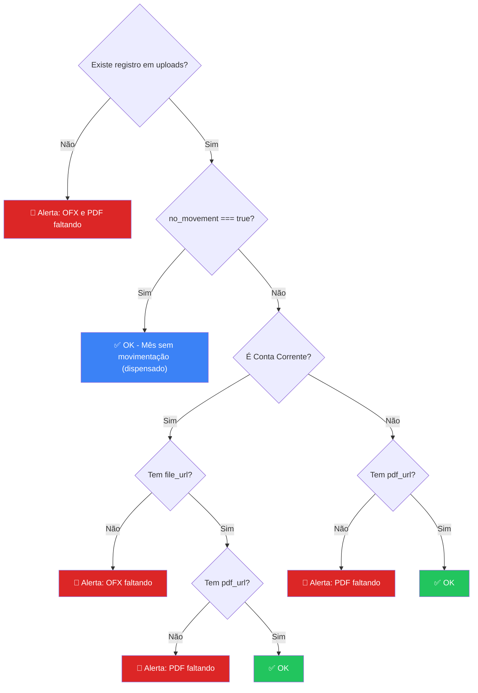
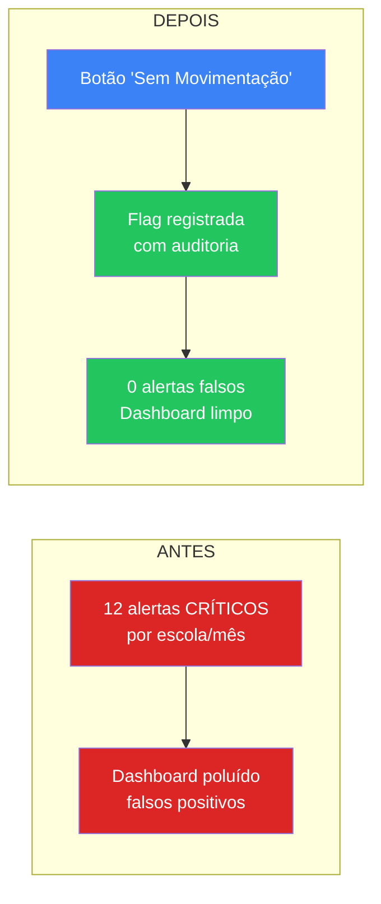

 # 🏦 Plano de Implementação: Flag "Sem Movimentação" na Conciliação Bancária

> **Problema:** Quando uma conta bancária não tem movimentação em um determinado mês, o banco não gera arquivo OFX — apenas PDF. Porém o sistema exige o OFX como parte da conciliação e gera alertas **CRÍTICOS** incessantes, poluindo o dashboard com falsos positivos.

---

## 📊 Diagnóstico do Sistema Atual



> [!WARNING]
> **O ponto crítico está em [useDashboard.ts:356-397](file:///d:/PROJETOS/brn-suite-escolas/src/hooks/useDashboard.ts#L356-L397)** — a lógica verifica se existe `file_url` (OFX) para Conta Corrente. Se não existe, gera alerta independente de existir movimentação ou não.

### Arquivos Impactados

| Arquivo | Papel | Tipo de Mudança |
|---------|-------|----------------|
| [db_statement_uploads.sql](file:///d:/PROJETOS/brn-suite-escolas/database/db_statement_uploads.sql) | Schema da tabela | Nova coluna `no_movement` |
| [types/index.ts](file:///d:/PROJETOS/brn-suite-escolas/src/types/index.ts#L320-L334) | Interface TypeScript | Novo campo no `StatementUpload` |
| [useDashboard.ts](file:///d:/PROJETOS/brn-suite-escolas/src/hooks/useDashboard.ts#L356-L397) | Lógica de alertas | Respeitar flag `no_movement` |
| [useBankReconciliation.ts](file:///d:/PROJETOS/brn-suite-escolas/src/hooks/useBankReconciliation.ts) | Hook de conciliação | Nova mutation + handler para "Sem Movimentação" |
| [ImportZone.tsx](file:///d:/PROJETOS/brn-suite-escolas/src/components/reconciliation/ImportZone.tsx) | Zona de upload | Botão "Sem Movimentação neste mês" |
| [ReconciliationHistoryModal.tsx](file:///d:/PROJETOS/brn-suite-escolas/src/components/reconciliation/ReconciliationHistoryModal.tsx) | Histórico | Badge visual + possibilidade de desfazer |

---

## 🏗️ Plano de Implementação

### Fase 1 — Database (Schema)

**Objetivo:** Adicionar campo `no_movement` à tabela `bank_statement_uploads`.

```sql
-- Migration: add_no_movement_flag
ALTER TABLE bank_statement_uploads 
  ADD COLUMN IF NOT EXISTS no_movement BOOLEAN DEFAULT false;

ALTER TABLE bank_statement_uploads 
  ADD COLUMN IF NOT EXISTS no_movement_reason TEXT;

ALTER TABLE bank_statement_uploads 
  ADD COLUMN IF NOT EXISTS no_movement_confirmed_by UUID REFERENCES users(id);

ALTER TABLE bank_statement_uploads 
  ADD COLUMN IF NOT EXISTS no_movement_confirmed_at TIMESTAMP WITH TIME ZONE;

COMMENT ON COLUMN bank_statement_uploads.no_movement 
  IS 'Quando true, indica que a conta não teve movimentação no mês. Dispensa arquivo OFX.';

COMMENT ON COLUMN bank_statement_uploads.no_movement_reason 
  IS 'Justificativa opcional para ausência de movimentação.';
```

> [!IMPORTANT]
> **Decisão de design:** O registro de `no_movement` é criado **na mesma tabela** `bank_statement_uploads` para manter a constraint UNIQUE `(bank_account_id, month, year, account_type)` intacta. Isso evita duplicidade e mantém a rastreabilidade no mesmo local onde já são registrados os uploads.

**Verificação:** `SELECT * FROM bank_statement_uploads WHERE no_movement = true;` → Deve retornar vazio após migration.

---

### Fase 2 — TypeScript Types

**Objetivo:** Atualizar a interface `StatementUpload` em [types/index.ts](file:///d:/PROJETOS/brn-suite-escolas/src/types/index.ts#L320-L334).

```diff
 export interface StatementUpload {
     id: string;
     school_id: string;
     bank_account_id: string;
     month: number;
     year: number;
     account_type: 'Conta Corrente' | 'Conta Investimento';
     file_url: string;
     file_name: string;
+    pdf_url?: string;
+    pdf_name?: string;
+    no_movement?: boolean;
+    no_movement_reason?: string;
+    no_movement_confirmed_by?: string;
+    no_movement_confirmed_at?: string;
     reported_revenue?: number;
     reported_taxes?: number;
     reported_balance?: number;
     uploaded_by?: string;
     created_at: string;
 }
```

---

### Fase 3 — Lógica de Alertas (Core Fix)

**Objetivo:** Fazer o `useDashboard.ts` respeitar a flag `no_movement` para não gerar alertas falsos.

**Local:** [useDashboard.ts:356-397](file:///d:/PROJETOS/brn-suite-escolas/src/hooks/useDashboard.ts#L356-L397)



**Mudança no código (conceitual):**

```diff
 // Dentro do loop periodsToCheck → schAccounts → types
 const uploadRecord = (uploads || []).find((u: any) =>
     u.bank_account_id === acc.id &&
     u.month === period.month &&
     u.year === period.year &&
     u.account_type === type
 );

+// Se o mês foi marcado como sem movimentação, não gera alerta
+if (uploadRecord?.no_movement) {
+    return; // Skip - mês sem movimentação confirmado
+}

 const isContaCorrente = type === 'Conta Corrente';
 let missingParts = [];
 // ... resto da lógica
```

---

### Fase 4 — UI: Botão "Sem Movimentação" na Zona de Import

**Objetivo:** Adicionar um botão discreto e profissional no `ImportZone.tsx` para permitir que o usuário declare que não houve movimentação.

**Comportamento:**
1. O botão aparece **somente quando** Escola + Conta Bancária + Mês estão selecionados
2. Ao clicar, abre um **mini-modal de confirmação** com:
   - Resumo (Escola, Conta, Mês/Ano)
   - Campo opcional de justificativa (ex: "Conta sem movimentação — banco não gerou OFX")
   - Botão "Confirmar Sem Movimentação"
3. Ao confirmar, cria/atualiza o registro em `bank_statement_uploads` com `no_movement = true`
4. Toast de sucesso: "Mês registrado como sem movimentação. Alertas suprimidos."

**Design do botão:**

```
┌──────────────────────────────────────────────────────┐
│                                                      │
│    [Zona de upload existente - arrastar OFX/PDF]     │
│                                                      │
├──────────────────────────────────────────────────────┤
│                        OU                            │
│                                                      │
│  ┌────────────────────────────────────────────────┐  │
│  │  🚫  Este mês não teve movimentação bancária   │  │
│  │      Clique para registrar ausência de OFX     │  │
│  └────────────────────────────────────────────────┘  │
└──────────────────────────────────────────────────────┘
```

---

### Fase 5 — Handler e Mutation no Hook

**Objetivo:** Adicionar no `useBankReconciliation.ts` a lógica para registrar "sem movimentação".

**Nova mutation:**

```typescript
const noMovementMutation = useMutation({
    mutationFn: async ({ reason }: { reason?: string }) => {
        const [year, month] = filterMonth.split('-').map(Number);
        
        // Upsert para não conflitar com registro existente
        const { error } = await supabase
            .from('bank_statement_uploads')
            .upsert({
                school_id: selectedSchoolId,
                bank_account_id: selectedBankAccountId,
                month,
                year,
                account_type: uploadType,
                no_movement: true,
                no_movement_reason: reason || 'Conta sem movimentação no período',
                no_movement_confirmed_by: user.id,
                no_movement_confirmed_at: new Date().toISOString(),
                uploaded_by: user.id
            }, {
                onConflict: 'bank_account_id, month, year, account_type'
            });

        if (error) throw error;
    },
    onSuccess: () => {
        queryClient.invalidateQueries({ queryKey: ['dashboard_data'] });
        queryClient.invalidateQueries({ queryKey: ['reconciliation_history'] });
        addToast('Mês registrado como sem movimentação.', 'success');
    }
});
```

---

### Fase 6 — Histórico Visual

**Objetivo:** Atualizar o `ReconciliationHistoryModal.tsx` para exibir corretamente registros "sem movimentação".

**Design:**

```
┌─────────────────────────────────────────────────────────┐
│  MAR.                                                   │
│  2026   CONTA CORRENTE   👤 CLAUDIOBRUNO                │
│         EQUIDADE                                        │
│         🏦 BB • AG: • CTA: 45610-1                      │
│                                                         │
│         ┌────────────────────────────────────┐           │
│         │ 🚫  SEM MOVIMENTAÇÃO               │  [🗑️]    │
│         │ Confirmado em 24/04/2026 às 08:15  │           │
│         └────────────────────────────────────┘           │
└─────────────────────────────────────────────────────────┘
```

**Mudança:** Quando `record.no_movement === true`, exibir badge especial ao invés dos botões de PDF/DADOS.

---

## 📋 Checklist de Implementação

| # | Tarefa | Arquivo | Complexidade | Deps |
|---|--------|---------|-------------|------|
| 1 | Migration: `ADD COLUMN no_movement` | `database/` + Supabase | 🟢 Baixa | — |
| 2 | Atualizar interface `StatementUpload` | `types/index.ts` | 🟢 Baixa | #1 |
| 3 | Fix lógica de alertas no dashboard | `useDashboard.ts` | 🟢 Baixa | #1 |
| 4 | Nova mutation `noMovementMutation` | `useBankReconciliation.ts` | 🟡 Média | #1, #2 |
| 5 | Modal de confirmação "Sem Movimentação" | Novo componente | 🟡 Média | #4 |
| 6 | Botão na `ImportZone.tsx` | `ImportZone.tsx` | 🟢 Baixa | #5 |
| 7 | Badge no `ReconciliationHistoryModal` | `ReconciliationHistoryModal.tsx` | 🟢 Baixa | #2 |
| 8 | Opção de desfazer (reverter flag) | `useBankReconciliation.ts` | 🟢 Baixa | #4 |

**Estimativa total:** ~2-3 horas de implementação.

---

## 🔒 Considerações de Segurança e Auditoria

> [!IMPORTANT]
> A flag `no_movement` **deve ser auditável**. Por isso registramos:
> - `no_movement_confirmed_by` → **Quem** confirmou
> - `no_movement_confirmed_at` → **Quando** confirmou
> - `no_movement_reason` → **Por quê** (justificativa)

### Regras de Negócio

1. **Quem pode marcar?** Apenas `Administrador`, `Operador` e `Diretor` (mesmas regras de `uploads_insert`)
2. **Reversível?** Sim — O Diretor/Admin pode excluir o registro e enviar o OFX normalmente depois
3. **PDF obrigatório?** **Não** — Se o banco não tem movimentação, muitas vezes não gera nem PDF. A flag dispensa ambos
4. **Conta Investimento também?** **Sim** — Investimento sem movimentação também é cenário válido (rendimento = R$ 0,00)

---

## 🎯 Resultado Esperado



> [!TIP]
> **Bonus futuro:** Podemos adicionar um atalho "Marcar *todos sem movimentação" no dashboard para quando uma escola inteira não teve atividade em um mês (útil para contas novas ou inativas).
